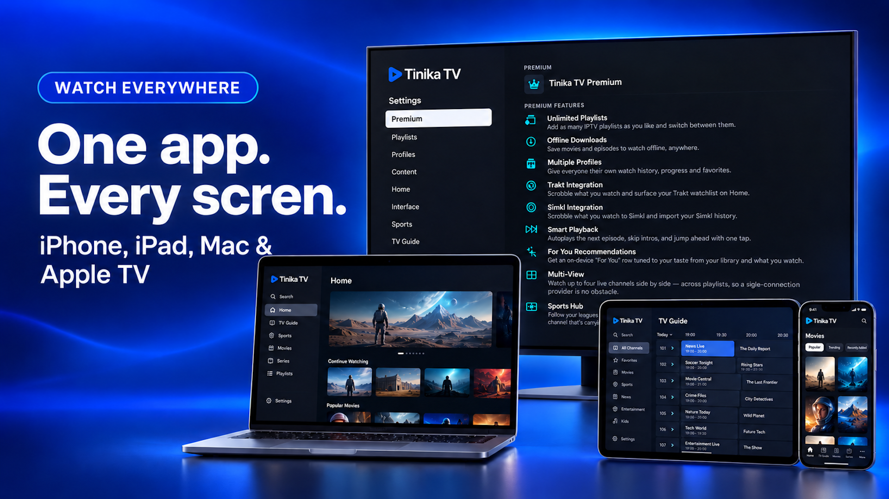

# Tinika TV

IPTV for **Apple TV, iPhone, iPad, Mac, and Vision Pro** — based on the full
[Lume](https://github.com/bilipp/Lume) codebase (AGPL-3.0), with Tinika TV branding.



- Site: <https://gennadii-time.github.io/Tinika-TV/>
- Privacy: <https://gennadii-time.github.io/Tinika-TV/privacy.html>
- Support: <support@tinika.lv>
- Plan: [`docs/PRODUCT_PLAN.md`](docs/PRODUCT_PLAN.md)

## Requirements

| | |
|---|---|
| Xcode | **26.4+** |
| tvOS / iOS / iPadOS | **18.0+** |
| macOS | **15.0+** |
| visionOS | **2.0+** |

Pinned commits: `docs/LUME_UPSTREAM_COMMIT.txt`, `docs/LUMEENGINE_UPSTREAM_COMMIT.txt`.  
Details: [`docs/BUILD_REQUIREMENTS.md`](docs/BUILD_REQUIREMENTS.md).

## Run (Mac)

```bash
open Lume.xcodeproj   # scheme Lume → display name Tinika TV
./Scripts/build-all-platforms.sh
```

Add your own M3U/Xtream source after launch — no bundled channels.

## Kept from Lume

Playlist sync, playback engines (KSPlayer / VLCKit / AVPlayer / LumeEngine),
platform-adaptive UI, EPG and archive/catch-up where the source supports them.

## License

AGPL-3.0 — see [`NOTICE`](NOTICE). Paid App Store distribution still requires
corresponding source under AGPL.
